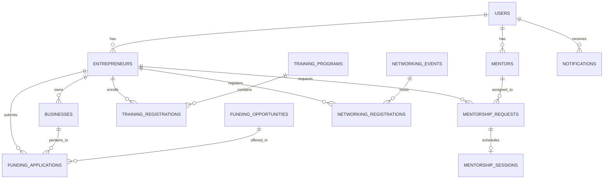

# Women Entrepreneurship Support Portal (Case Study 33 – SDG 5)
### Final University Software Engineering Project Documentation & Submission Package


---

## 1. Project Overview & Case Study Traceability

- **Project Title**: Women Entrepreneurship Support Portal
- **Case Study**: Case Study 33 – SDG 5
- **Primary SDG**: **SDG 5: Gender Equality** (Target 5.a – Equal rights to economic resources, financial services, and property ownership)
- **Target Audience**: Women Entrepreneurs, Ministry & MSME Government Officers, Certified Industry Mentors

### Quick Links to Project Documentation
- 📘 [Software Engineering & UML Specifications](file:///C:/Users/kiran/.gemini/antigravity/brain/13cb9ce3-bd85-49af-86e9-aa7714608f02/software_engineering_documentation.md)
- 🧪 [Comprehensive Test Cases (25 Tests)](file:///C:/Users/kiran/.gemini/antigravity/scratch/women-entrepreneurship-portal/TEST_CASES.md)
- 🎓 [University Viva Q&A Guide](file:///C:/Users/kiran/.gemini/antigravity/scratch/women-entrepreneurship-portal/VIVA_QA.md)
- 🎬 [Step-by-Step Demo Script (5-10 Mins)](file:///C:/Users/kiran/.gemini/antigravity/scratch/women-entrepreneurship-portal/DEMO_GUIDE.md)

---

## 2. Problem Statement & Proposed Solution

### Problem Statement
Many women-owned small businesses struggle to access government schemes, financial assistance, business mentoring, training programs, and networking opportunities. Existing information is fragmented across multiple websites and sources, creating technical and administrative barriers for female founders.

### Proposed Solution
The **Women Entrepreneurship Support Portal** provides a single, centralized digital platform connecting female entrepreneurs directly with government support programs, capital expansion grants, capacity-building workshops, certified industry mentors, and networking conventions.

---

## 3. System Objectives & Features

- **Centralization**: Consolidate fragmented government support policies into one searchable digital portal.
- **Capital Access**: Streamline funding applications for capital grants, soft loans, interest subvention, and seed capital via a **Multi-Step Application Modal**.
- **Application Tracking**: Visual progress tracking timeline (`Submitted` → `Under Review` → `Approved` / `Rejected`) with officer remarks.
- **Recommendation Engine**: Rule-based opportunity matching engine recommending schemes, grants, workshops, and mentors tailored to the entrepreneur's business sector.
- **Capacity Building**: Facilitate enrollment in business management, e-commerce, and export trade training workshops.
- **Mentorship & Networking**: Connect female founders 1-on-1 with industry advisors and national founder summits.
- **Officer Governance & Reporting**: Verification audit queue with mandatory rejection reasons, Recharts visual analytics, and **1-Click CSV Report Export**.

---

## 4. System Actors & Roles

1. **👩‍💼 Women Entrepreneur (`entrepreneur`)**: Registers business profiles, searches schemes, applies for funding grants, tracks progress, enrolls in training, and requests mentorship.
2. **🏛️ Government Officer (`officer`)**: Audits entrepreneur profiles, verifies Udyam registration, manages schemes/grants/events, reviews applications, and exports analytics reports to CSV.
3. **🎓 Certified Mentor (`mentor`)**: Manages availability slots, reviews mentorship requests, conducts virtual sessions, and submits advisory feedback.

---

## 5. Technology Stack & Layered Architecture

```
+-------------------------------------------------------------------+
|                     PRESENTATION LAYER                            |
|        React 18 SPA + Vite + Tailwind/CSS + Recharts              |
+-------------------------------------------------------------------+
                                 |  HTTP / REST JSON APIs
                                 v
+-------------------------------------------------------------------+
|                     APPLICATION & API LAYER                       |
|           Node.js + Express.js + JWT Authorization Guard           |
+-------------------------------------------------------------------+
                                 |  Business Logic & Validation
                                 v
+-------------------------------------------------------------------+
|                    DATA ACCESS LAYER & DB                         |
|         sql.js WebAssembly SQLite + Auto-Disk Sync Engine          |
+-------------------------------------------------------------------+
```

---

## 6. Database Overview & Schema

The database uses a normalized SQLite schema with 16 tables:
`users`, `entrepreneurs`, `businesses`, `schemes`, `funding_opportunities`, `funding_applications`, `training_programs`, `training_registrations`, `mentors`, `mentorship_requests`, `mentorship_sessions`, `networking_events`, `networking_registrations`, `announcements`, `notifications`, `documents`.



---

## 7. Demo Credentials

The application is pre-seeded with standardized accounts for demonstration:

| Role | Email | Password | Representative Account |
| :--- | :--- | :--- | :--- |
| **Women Entrepreneur** | `entrepreneur@womenportal.test` | `Password123!` | Priya Sharma (EcoCraft India Handicrafts) |
| **Government Officer** | `officer@womenportal.test` | `Password123!` | Rajesh Varma (Ministry of MSME) |
| **Mentor** | `mentor@womenportal.test` | `Password123!` | Dr. Sunita Rao (Senior Venture Advisor) |

> [!TIP]
> Use the sticky **Demo Toolbar** at the top of the portal to switch roles with 1-click!

---

## 8. Setup & Execution Commands

### Prerequisites
- Node.js (v18 or higher)
- npm (v9 or higher)

### Installation & Run Steps

```bash
# 1. Open project directory
cd C:\Users\kiran\.gemini\antigravity\scratch\women-entrepreneurship-portal

# 2. Install dependencies (if not installed)
npm install

# 3. Seed database with realistic sample records
npm run seed

# 4. Build frontend production assets
npm run client:build

# 5. Start full-stack Express server (Runs at http://localhost:5000)
npm start
```

---

## 9. Automated Testing Verification

Run the automated verification suite:

```bash
node server/test/smoke.js
```

### Verification Output
```
✅ [PASS] GET /api/schemes returned 5 active schemes (Status: 200)
✅ [PASS] GET /api/funding returned 5 active funding opportunities (Status: 200)
✅ [PASS] GET /api/training returned 5 training programs (Status: 200)
✅ [PASS] GET /api/mentors returned 3 certified mentors (Status: 200)
✅ [PASS] GET /api/networking-events returned 5 events (Status: 200)
✅ [PASS] GET /api/announcements returned 5 announcements (Status: 200)
🎉 ALL BACKEND API ENDPOINTS & DATABASE VERIFIED 100% WORKING!
```

---

## 10. Security & Data Privacy

- Passwords are never stored as plain text (`bcryptjs` salt factor 10).
- Session authorization enforced via JWT tokens.
- Frontend route guards (`ProtectedRoute`) and backend middleware guards (`authorizeRoles`) prevent unauthorized access.
- Sensitive environment variables are configured in `.env.example` and excluded via `.gitignore`.
