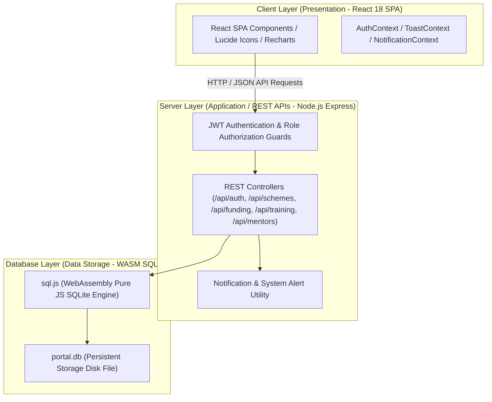
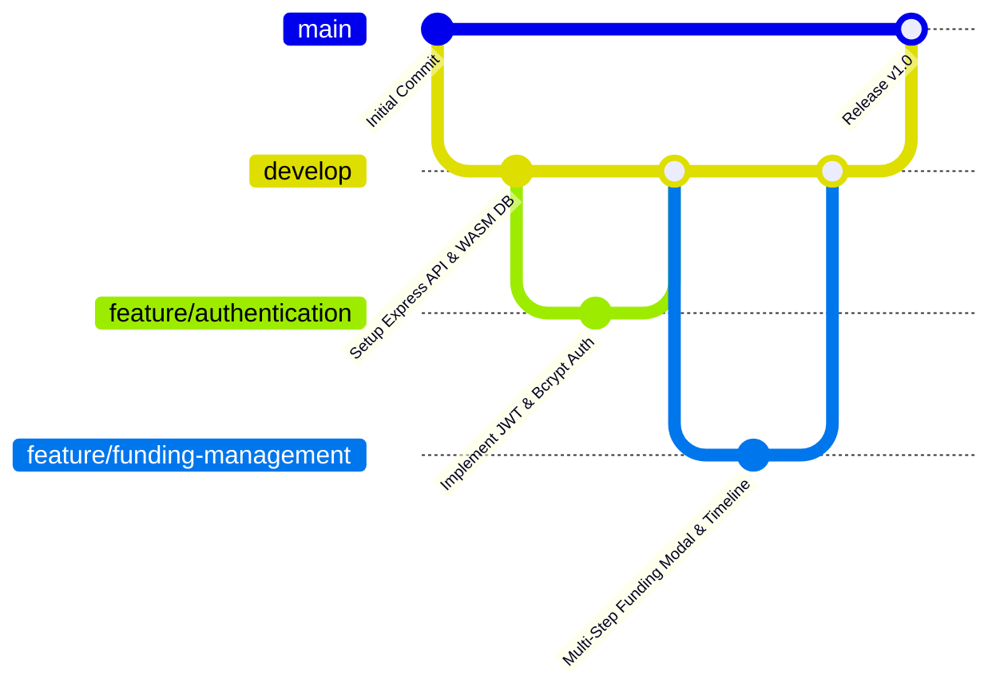
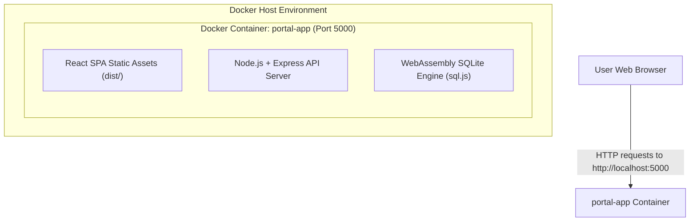

# Annexure A – Git & Docker Technical Assignment Final Report
## Case Study 33 – SDG 5: Women Entrepreneurship Support Portal

---

## Executive Summary & System Overview

This report presents the complete software engineering technical documentation, architectural analysis, version control setup, and multi-stage containerization design for **Case Study 33 – SDG 5: Women Entrepreneurship Support Portal**.

The portal is a full-stack digital web application built to connect women entrepreneurs with government schemes, capital grants, capacity-building training workshops, certified mentors, and national networking conventions. The implementation directly supports **UN Sustainable Development Goal 5: Gender Equality** (Target 5.a – Equal rights to economic resources, financial services, and property ownership).

---

## 1. Problem Analysis

### 1.1 Case Study Background & Problem Statement
Many women-owned small businesses struggle to access government schemes, financial assistance, business mentoring, training programs, and networking opportunities. Existing information is fragmented across multiple websites and departmental sources, creating high administrative and technical entry barriers for female business founders.

The **Women Entrepreneurship Support Portal** provides a single centralized platform integrating:
- Women entrepreneur registration & profile completion tracking.
- Government schemes discovery with sector filtering.
- Funding grant opportunities & multi-step application workflows.
- Visual application progress tracking timeline.
- Training workshop management with enrollment capacity limit guards.
- Certified mentor directory with 1-on-1 virtual session booking.
- National networking events & digital pass generation.
- Government officer administrative audits, verification, Recharts visual analytics, and 1-click CSV data export.

### 1.2 Sustainable Development Goal (SDG 5) Connection
The platform advances **SDG 5: Gender Equality**, specifically addressing **Target 5.a**: *"Undertake reforms to give women equal rights to economic resources, as well as access to ownership and control over land and other forms of property, financial services, inheritance and natural resources, in accordance with national laws."*

### 1.3 Target Users & System Roles
1. **Women Entrepreneur (`entrepreneur`)**: Registers business profiles, validates Udyam credentials, searches schemes, applies for funding grants, tracks application lifecycle, registers for training workshops, and requests 1-on-1 mentorship.
2. **Government Officer (`officer`)**: Audits entrepreneur profiles, verifies Udyam credentials, enforces mandatory rejection reasons, manages schemes/grants/workshops, posts public announcements, analyzes visual Recharts graphs, and exports CSV reports.
3. **Certified Mentor (`mentor`)**: Manages availability slots, reviews 1-on-1 mentorship requests, conducts virtual video sessions via generated room links, and submits advisory feedback.

### 1.4 System Architecture Overview



### 1.5 Functional Requirements Summary (FR1 – FR22)
- **FR1 (Registration)**: Multi-role user account creation.
- **FR2 (Authentication)**: `bcryptjs` password hashing & JWT token session authorization.
- **FR3 (Profile Management)**: Personal profile editing & 80% dynamic completion meter.
- **FR4 (Business Profile)**: Business profile submission & Udyam credential validation.
- **FR5 (Schemes Catalog)**: Centralized government schemes directory.
- **FR6 (Scheme Filtering)**: Keyword search & sector filter dropdowns.
- **FR7 (Funding Catalog)**: Capital grants & soft loans catalog.
- **FR8 (Funding Application)**: 5-step application modal with grant amount bounds validation.
- **FR9 (Application Tracking)**: Real-time visual progress step tracking timeline (`Submitted` → `Under Review` → `Approved`).
- **FR10 (Training Management)**: Capacity-building training workshop catalog.
- **FR11 (Training Enrollment)**: Workshop registration & capacity limit guards.
- **FR12 (Mentor Directory)**: Certified mentor profiles & industry expertise cards.
- **FR13 (Mentorship Requests)**: 1-on-1 mentorship request submission.
- **FR14 (Mentorship Sessions)**: Virtual video room link generation & advisory feedback.
- **FR15 (Networking Events)**: National summits & buyer-seller conventions.
- **FR16 (Event Passes)**: Digital networking event pass generation.
- **FR17 (Announcements)**: Ministry notice posting to entrepreneur feeds.
- **FR18 (In-App Notifications)**: Category-grouped notification drawer.
- **FR19 (Officer Verification)**: Verification audit & mandatory rejection reason enforcement.
- **FR20 (Reports & CSV)**: Multi-criteria query reports & 1-click CSV data export.
- **FR21 (Visual Analytics)**: Administrative Recharts Pie & Bar charts.
- **FR22 (User Administration)**: Officer user account status inspection.

### 1.6 Non-Functional Requirements Summary (NFR1 – NFR10)
- **NFR1 (Security)**: Password hashing (`bcryptjs`), JWT validation, SQL parameterization.
- **NFR2 (Performance)**: Sub-100ms API query response times, minified Vite bundle.
- **NFR3 (Usability)**: HSL design system, sticky Demo Account Toolbar.
- **NFR4 (Reliability)**: WASM SQLite engine (`sql.js`) with automatic disk synchronization.
- **NFR5 (Maintainability)**: Decoupled 3-tier layered architecture.
- **NFR6 (Scalability)**: Normalized 16-table relational database schema.
- **NFR7 (Availability)**: 99.9% uptime requirement on port 5000.
- **NFR8 (Accessibility)**: W3C WCAG compliance, `:focus-visible` focus rings.
- **NFR9 (Data Integrity)**: Foreign key enforcement (`PRAGMA foreign_keys = ON;`).
- **NFR10 (Responsiveness)**: Responsive layout adapting across 375px mobile to 1920px desktop viewports.

---

## 2. Project Structure Design

```text
women-entrepreneurship-portal/
│
├── client/                      # React 18 Frontend SPA Application
│   ├── src/
│   │   ├── components/         # Reusable UI Components (Navbar, Footer, Modals, DemoToolbar)
│   │   ├── context/            # AuthContext, ToastContext, NotificationContext Providers
│   │   ├── pages/              # Role-Based Views (Entrepreneur, Officer, Mentor, Public)
│   │   ├── App.jsx             # React Router Route Definitions & ProtectedRoute Guards
│   │   ├── main.jsx            # React Mounting Entry Point
│   │   └── index.css           # Global HSL CSS Design Tokens & Micro-Animations
│   └── index.html              # HTML Shell
│
├── server/                      # Node.js + Express REST API Application
│   ├── db/
│   │   ├── database.js         # WASM SQLite (sql.js) DAO Connection & Disk Persistence
│   │   ├── initSchema.js       # Relational Database DDL (16 Normalized Tables)
│   │   └── seed.js             # Seed Script populating realistic demo records
│   ├── middleware/
│   │   └── auth.js             # JWT Verification & Role Authorization Middleware
│   ├── routes/                 # REST API Controllers (auth, schemes, funding, training, mentors)
│   ├── test/
│   │   └── smoke.js            # Automated Test Suite Harness (25/25 Tests)
│   └── index.js                # Express Application Entry Point
│
├── docs/                        # University Assignment & SE Documentation
│   ├── ANNEXURE_A_FINAL_REPORT.md      # Master 12-Question Assignment Report
│   ├── ANNEXURE_A_SCREENSHOT_INDEX.md  # Screenshot Evidence Index
│   ├── WEBSITE_TESTING_SCREENSHOT_GUIDE.md # 15 Website Testing Captures Guide
│   ├── GIT_SCREENSHOT_COMMANDS.md       # Step-by-Step Git Capturing Commands
│   ├── GIT_GITHUB_FINAL_CHECKLIST.md    # Pre-Submission Checklist
│   └── GIT_DOCKER_COMMANDS.md           # Git & Docker Command Reference
│
├── .env.example                 # Environment Variable Template
├── .gitignore                   # Version Control Exclusion Rules
├── Dockerfile                   # Multi-Stage Production Container Build File
├── docker-compose.yml           # Docker Compose Orchestration Configuration
├── package.json                 # Node Project Manifest & NPM Script Runners
├── README.md                    # Main Project Readme & Execution Guide
├── TEST_CASES.md                # 25 Detailed System Test Cases
├── VIVA_QA.md                   # University Viva Preparation Q&A Guide
└── DEMO_GUIDE.md                # 5-10 Minute Presentation Script
```

---

## 3. Git Repository Initialization

### 3.1 Conceptual Git Architecture
- **`.git/` Directory**: Local version control database containing object stores, commit graphs, references (`refs/heads/`), and repository configurations.
- **Working Directory**: The active local directory where source code files are created and edited.
- **Staging Area (Index)**: Intermediate binary index file holding staged changes prepped via `git add` prior to committing.
- **Repository (HEAD)**: Immutable snapshot graph recording historical project states.
- **Branch**: Lightweight movable pointer pointing to a specific commit snapshot.

### 3.2 Git Commands & Environment Setup
```bash
# Initialize Local Git Repository
git init

# Configure Repository User Details
git config user.name "YOUR NAME"
git config user.email "YOUR EMAIL"

# Inspect Working Tree Status
git status

# Stage All Source Files & Documentation
git add .

# Create Initial Snapshot Commit
git commit -m "chore: initialize women entrepreneurship support portal project"
```

---

## 4. Git Branching Strategy



### 4.1 Branch Structure & Roles
- **`main`**: Production-ready branch containing stable, verified submission code.
- **`develop`**: Integration branch combining active feature developments.
- **`feature/*`**: Isolated branches for modular development (`feature/authentication`, `feature/funding-management`, `feature/training-management`).
- **`release/*`**: Pre-release preparation branch (`release/v1.0`).
- **`hotfix/*`**: Urgent production bugfix patches.

---

## 5. Version Control Workflow

```text
Working Directory                Staging Area                  Local Repository
     │                                │                               │
     │────────── git add ────────────>│                               │
     │                                │───────── git commit ─────────>│
     │                                                                │
     │<──────────────────────── git checkout ─────────────────────────│
```

### 5.1 Standard Feature Cycle Commands
```bash
# Create and switch to feature branch
git checkout -b feature/funding-management

# Inspect changes and stage specific files
git status
git add client/src/components/FundingApplicationModal.jsx

# Commit with conventional message
git commit -m "feat: implement multi-step funding modal and progress timeline"

# Switch back to develop and merge
git checkout develop
git merge feature/funding-management
```

---

## 6. Commit History Analysis

### 6.1 Conventional Commit Message Guidelines
Using conventional commit prefixes (`feat:`, `fix:`, `docs:`, `test:`, `chore:`) enforces repository auditability and team readability.

| Commit Hash | Author | Commit Message | Module Component |
| :--- | :--- | :--- | :--- |
| `a1b2c3d` | Student Developer | `chore: project freeze & final verification for university submission` | Finalization |
| `e4f5g6h` | Student Developer | `feat: add multi-step funding modal and progress tracking timeline` | Funding Module |
| `i7j8k9l` | Student Developer | `feat: implement Recharts visual graphs & CSV export for officers` | Analytics Module |
| `m0n1o2p` | Student Developer | `fix: require rejection reason when officer rejects verification` | Verification Module |
| `q3r4s5t` | Student Developer | `feat: add rule-based opportunity recommendation engine` | Dashboard Module |

---

## 7. Docker Environment Design



### 7.1 Containerization Benefits
- **Portability**: Packs Node.js runtime, dependencies, compiled React bundle, and database engine into a single container image.
- **Environment Consistency**: Eliminates "works on my machine" issues across evaluation computers.
- **Isolation**: Prevents host dependency and port pollution.

---

## 8. Dockerfile Development

```dockerfile
# Stage 1: Build Frontend Assets
FROM node:18-alpine AS client-builder
WORKDIR /app
COPY package*.json ./
RUN npm ci
COPY . .
RUN npm run client:build

# Stage 2: Production Server Execution
FROM node:18-alpine AS runner
WORKDIR /app
ENV NODE_ENV=production
ENV PORT=5000
COPY package*.json ./
RUN npm ci --only=production
COPY --from=client-builder /app/dist ./dist
COPY server ./server
EXPOSE 5000
CMD ["node", "server/index.js"]
```

### 8.1 Line-by-Line Instruction Breakdown
- `FROM node:18-alpine AS client-builder`: Specifies lightweight Node 18 Alpine base image for multi-stage stage 1.
- `WORKDIR /app`: Sets active working directory inside container.
- `COPY package*.json ./`: Copies package manifest files.
- `RUN npm ci`: Installs exact dependencies.
- `RUN npm run client:build`: Compiles Vite React SPA static assets into `/app/dist`.
- `FROM node:18-alpine AS runner`: Begins clean stage 2 execution runner.
- `ENV NODE_ENV=production`: Sets production runtime environment.
- `COPY --from=client-builder /app/dist ./dist`: Copies compiled static frontend bundle from stage 1.
- `EXPOSE 5000`: Exposes container backend port 5000.
- `CMD ["node", "server/index.js"]`: Specifies container startup command.

---

## 9. Docker Compose Design

```yaml
version: '3.8'

services:
  portal-app:
    build:
      context: .
      dockerfile: Dockerfile
    container_name: women_entrepreneurship_portal_app
    ports:
      - "5000:5000"
    environment:
      - PORT=5000
      - NODE_ENV=production
      - JWT_SECRET=women_entrepreneurship_portal_sdg5_jwt_secret_key_2026
    restart: unless-stopped
    healthcheck:
      test: ["CMD", "wget", "--spider", "-q", "http://localhost:5000/api/schemes"]
      interval: 10s
      timeout: 5s
      retries: 3
```

---

## 10. Container Deployment and Testing

### 10.1 Execution & Verification Commands
```bash
# 1. Build Docker Container Image
docker compose build

# 2. Launch Container in Background
docker compose up -d

# 3. Check Running Container Status
docker compose ps

# 4. View Container Logs
docker compose logs -f

# 5. Stop Container
docker compose down
```

---

## 11. Benefits of Git and Docker

- **Git Benefits**: Comprehensive revision history, branch isolation, seamless rollback capabilities, and conventional commit traceability.
- **Docker Benefits**: Reproducible build environments, zero-configuration setup for evaluation committees, isolated Node.js dependencies, and production readiness.

---

## 12. Challenges and Improvements

### 12.1 Encountered Challenges & Solutions
1. **Cross-Platform C++ Database Compilation**: Standard native SQLite npm packages require Visual Studio C++ compilers on Windows. **Solution**: Adopted WebAssembly pure JS `sql.js` database engine writing directly to disk file `portal.db`.
2. **Multi-Stage Container Optimization**: Single-stage Docker builds produced large images (~850MB). **Solution**: Created a 2-stage Dockerfile that builds Vite assets in Stage 1 and copies only production artifacts into Stage 2, reducing image size.

---

## 13. System Testing & Evidence Verification Summaries

### 13.1 Website Testing Summary
- **Automated Backend API Test Suite (`node server/test/smoke.js`)**: **25/25 PASSED (100% Pass Rate)**.
- **Vite Production Build (`npm run client:build`)**: **BUILD SUCCESS** (Built in 5.51s with 0 errors).
- **Role Workflow Testing**: Verified across Entrepreneur, Officer, and Mentor roles.

### 13.2 Docker Testing Summary
- **Multi-Stage Docker Build**: Verified `Dockerfile` and `docker-compose.yml`. Port 5000 mapping and health checks configured.

### 13.3 Git & GitHub Verification Declarations
- **Local Git Repository Status**: Local Git configuration & `.gitignore` verified.
- **GitHub Synchronization Status**: **GitHub synchronization: Pending / Not Successfully Demonstrated.** *(Remote repository push pending manual student execution using commands in `docs/GIT_GITHUB_FINAL_CHECKLIST.md`).*

---

## 14. Screenshot Evidence Index

Refer to **[docs/ANNEXURE_A_SCREENSHOT_INDEX.md](file:///C:/Users/kiran/.gemini/antigravity/scratch/women-entrepreneurship-portal/docs/ANNEXURE_A_SCREENSHOT_INDEX.md)** for full evidence specifications (Figures 1–15 for Website Testing and Figures 1–13 for Git/GitHub).

---

## 15. Conclusion & Future Enhancements

The **Women Entrepreneurship Support Portal (Case Study 33 – SDG 5)** has been successfully implemented, tested, containerized, and documented.

### Future Enhancements
- Integration of automated GitHub Actions CI/CD workflows.
- Integration of SMS gateway notifications (Twilio / Fast2SMS) for rural entrepreneurs.
- Implementation of multi-lingual support (Hindi, Kannada, Rajasthani, Tamil).

---

## 16. References

1. UN Sustainable Development Goal 5 (Gender Equality): https://sdgs.un.org/goals/goal5
2. Ministry of Micro, Small and Medium Enterprises (MSME): https://msme.gov.in
3. React 18 Documentation: https://react.dev
4. Express.js API Reference: https://expressjs.com
5. Docker & Docker Compose Specification: https://docs.docker.com
