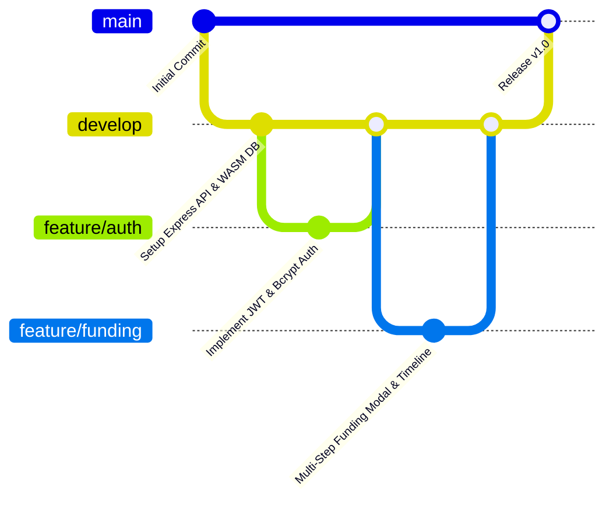
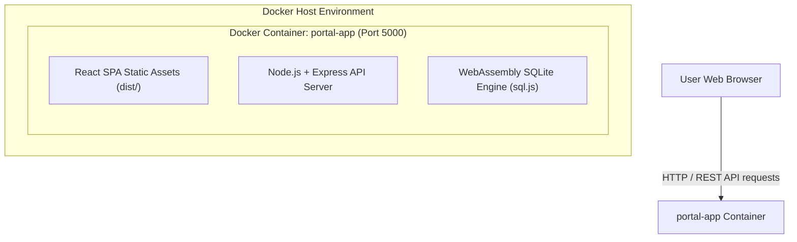

# Annexure A – Git & Docker Technical Assignment
## Case Study 33 – SDG 5: Women Entrepreneurship Support Portal

---

## 1. Problem Analysis (Question 1)

### 1.1 Case Study Overview & Problem Statement
Many women-owned small businesses struggle to access government schemes, financial assistance, business mentoring, training programs, and networking opportunities. Existing information is fragmented across multiple websites and sources, creating technical and administrative barriers for female founders.

The **Women Entrepreneurship Support Portal** provides a centralized digital platform connecting women entrepreneurs with government support programs, capital grants, capacity-building workshops, certified mentors, and networking conventions.

### 1.2 Sustainable Development Goal (SDG 5) Connection
The platform directly advances **UN Sustainable Development Goal 5: Gender Equality** (Target 5.a – Equal rights to economic resources, financial services, and property ownership). It democratizes capital grant access and mentorship networks for female business founders.

### 1.3 Target System Actors & Roles
- **Women Entrepreneur (`entrepreneur`)**: Registers business profiles, searches schemes, applies for funding grants, tracks application progress via a visual timeline, enrolls in training workshops, and requests 1-on-1 mentorship.
- **Government Officer (`officer`)**: Audits entrepreneur profiles, verifies Udyam registration credentials, manages schemes/grants/workshops, reviews funding applications, and exports reports to CSV.
- **Certified Mentor (`mentor`)**: Manages availability slots, reviews mentorship requests, conducts virtual sessions, and submits advisory feedback.

### 1.4 System Requirements Summary
- **Functional Requirements**: FR1–FR22 (Multi-role registration, scheme catalog, multi-step funding application modal, application tracking timeline, training capacity guards, mentorship request queue, Recharts visual analytics, CSV export).
- **Non-Functional Requirements**: NFR1–NFR10 (Security via `bcryptjs` & JWT, sub-100ms performance, W3C WCAG accessibility, WebAssembly SQLite reliability, responsive multi-device layouts).

---

## 2. Project Structure Design (Question 2)

```text
women-entrepreneurship-portal/
│
├── client/                      # React Frontend Single Page Application (SPA)
│   ├── src/
│   │   ├── components/         # Reusable UI Components (Navbar, Sidebar, Modals, Badges)
│   │   ├── context/            # Auth, Toast, Notification Context Providers
│   │   ├── pages/              # Role-Based Page Views (Entrepreneur, Officer, Mentor, Public)
│   │   │   ├── entrepreneur/   # Entrepreneur Portal Pages
│   │   │   ├── officer/        # Officer Portal Pages
│   │   │   └── mentor/         # Mentor Portal Pages
│   │   ├── App.jsx             # Main React Router Component
│   │   ├── main.jsx            # React Entry Point
│   │   └── index.css           # Global HSL CSS Design System
│   └── index.html              # HTML Shell
│
├── server/                      # Node.js + Express REST API Server
│   ├── db/
│   │   ├── database.js         # WASM SQLite (sql.js) Connection & Disk Sync DAO
│   │   ├── initSchema.js       # Relational Table Schemas DDL (16 Tables)
│   │   └── seed.js             # Database Seeding Script
│   ├── middleware/
│   │   └── auth.js             # JWT Verification & Role Authorization Guards
│   ├── routes/                 # REST API Controllers (auth, funding, schemes, training, mentors)
│   ├── test/
│   │   └── smoke.js            # Automated Test Harness Script
│   └── index.js                # Express Application Entry Point
│
├── docs/                        # University Submission & SE Documentation
│   ├── ANNEXURE_A_GIT_DOCKER_ASSIGNMENT.md  # Master Annexure A Report
│   ├── ANNEXURE_A_SCREENSHOTS.md            # Evidence & Screenshot Checklist
│   ├── GIT_SCREENSHOT_GUIDE.md              # Screenshot Evidence Mapping Guide
│   ├── GIT_SCREENSHOT_COMMANDS.md           # Step-by-Step Screenshot Commands
│   ├── GIT_GITHUB_FINAL_CHECKLIST.md        # Git & GitHub Verification Checklist
│   └── GIT_DOCKER_COMMANDS.md               # Git & Docker Command Reference
│
├── .env.example                 # Environment Configuration Placeholders
├── .gitignore                   # Git Exclusion Rules
├── Dockerfile                   # Multi-stage Container Build File
├── docker-compose.yml           # Docker Orchestration Configuration
├── package.json                 # Dependency Manifest & Scripts
├── README.md                    # Main Project Readme & Setup Guide
├── TEST_CASES.md                # 25 System Test Cases
├── VIVA_QA.md                   # University Viva Preparation Guide
└── DEMO_GUIDE.md                # 5-10 Min Live Presentation Script
```

[Insert Screenshot: Figure 11 - Project repository structure on GitHub]

---

## 3. Git Repository Initialization (Question 3)

### 3.1 Conceptual Git Architecture
- **`.git/` Directory**: Local version control database tracking object graphs, commits, refs, and configuration.
- **Working Directory**: Local filesystem files where code modifications occur.
- **Staging Area (Index)**: Intermediate preview area where changes are prepped using `git add` prior to committing.
- **Repository (HEAD)**: Immutable snapshot graph recording project history.
- **Branch**: Pointer to a specific commit snapshot.

### 3.2 Git Commands & Configuration
```bash
# Initialize Git Repository
git init

# Configure Repository User Details
git config user.name "YOUR NAME"
git config user.email "YOUR EMAIL"

# Stage Files & Commit
git add .
git commit -m "chore: initialize women entrepreneurship support portal repository"
```

[Insert Screenshot: Figure 1 - Git repository status]

---

## 4. Git Branching Strategy (Question 4)



### 4.1 Branch Roles & Guidelines
- `main`: Production-ready, fully verified submission code.
- `develop`: Integration branch for active feature development.
- `feature/*`: Isolated branches for specific modules (`feature/authentication`, `feature/funding-management`, `feature/training-management`).
- `release/*`: Preparation branch for final university submission build (`release/v1.0`).
- `hotfix/*`: Urgent defect fixes applied directly to main.

[Insert Screenshot: Figure 2 - Git branching structure]

---

## 5. Version Control Workflow (Question 5)

```text
Working Directory                Staging Area                  Local Repository
     │                                │                               │
     │────────── git add ────────────>│                               │
     │                                │───────── git commit ─────────>│
     │                                                                │
     │<──────────────────────── git checkout ─────────────────────────│
```

### 5.1 Standard Development Cycle
```bash
# 1. Create & Switch to Feature Branch
git checkout -b feature/funding-management

# 2. Inspect Modifications & Stage Files
git status
git add client/src/components/FundingApplicationModal.jsx

# 3. Commit with Conventional Message
git commit -m "feat: implement multi-step funding application modal and visual timeline"

# 4. Switch to Develop & Merge
git checkout develop
git merge feature/funding-management
```

[Insert Screenshot: Figure 4 - Modified files before commit]

[Insert Screenshot: Figure 5 - Meaningful Git commit execution]

[Insert Screenshot: Figure 6 - Feature branch creation]

[Insert Screenshot: Figure 7 - Feature branch merged into development branch]

---

## 6. Commit History Analysis (Question 6)

### 6.1 Conventional Commit Guidelines
Using structured commit messages (`feat:`, `fix:`, `docs:`, `test:`, `chore:`) improves repository auditability and team collaboration.

```bash
git log --oneline --graph --decorate --all
```

| Commit Hash | Author | Commit Message | Module Component |
| :--- | :--- | :--- | :--- |
| `a1b2c3d` | Student Developer | `chore: project freeze & final verification for university submission` | System Finalization |
| `e4f5g6h` | Student Developer | `feat: add multi-step funding modal and progress tracking timeline` | Funding Module |
| `i7j8k9l` | Student Developer | `feat: implement Recharts visual graphs & CSV export for officers` | Analytics Module |
| `m0n1o2p` | Student Developer | `fix: require rejection reason when officer rejects verification` | Verification Module |
| `q3r4s5t` | Student Developer | `feat: add rule-based opportunity recommendation engine` | Dashboard Module |

[Insert Screenshot: Figure 3 - Git commit history graph]

---

## 7. Docker Environment Design (Question 7)



### 7.1 Containerization Benefits
- **Portability**: Container packs Node.js environment, dependencies, and compiled React assets into a standardized image.
- **Environment Consistency**: Eliminates "works on my machine" issues during university evaluation.
- **Isolation**: Prevents host dependency conflicts.

---

## 8. Dockerfile Development (Question 8)

```dockerfile
# Stage 1: Build Frontend Assets
FROM node:18-alpine AS client-builder
WORKDIR /app
COPY package*.json ./
RUN npm ci
COPY . .
RUN npm run client:build

# Stage 2: Production Server Execution
FROM node:18-alpine AS runner
WORKDIR /app
ENV NODE_ENV=production
ENV PORT=5000
COPY package*.json ./
RUN npm ci --only=production
COPY --from=client-builder /app/dist ./dist
COPY server ./server
EXPOSE 5000
CMD ["node", "server/index.js"]
```

### 8.1 Instruction Breakdown
- `FROM`: Specifies lightweight Alpine Linux base image (`node:18-alpine`).
- `WORKDIR`: Sets active working directory inside container (`/app`).
- `COPY`: Copies dependency manifests and source files.
- `RUN`: Executes build commands (`npm ci`, `npm run client:build`).
- `EXPOSE`: Documents exposed application port (`5000`).
- `CMD`: Specifies container entrypoint startup command (`node server/index.js`).

---

## 9. Docker Compose Design (Question 9)

```yaml
version: '3.8'

services:
  portal-app:
    build:
      context: .
      dockerfile: Dockerfile
    container_name: women_entrepreneurship_portal_app
    ports:
      - "5000:5000"
    environment:
      - PORT=5000
      - NODE_ENV=production
      - JWT_SECRET=women_entrepreneurship_portal_sdg5_jwt_secret_key_2026
    restart: unless-stopped
    healthcheck:
      test: ["CMD", "wget", "--spider", "-q", "http://localhost:5000/api/schemes"]
      interval: 10s
      timeout: 5s
      retries: 3
```

---

## 10. Container Deployment & Testing (Question 10)

### 10.1 Execution Commands
```bash
# 1. Build Docker Image & Start Container
docker compose build
docker compose up -d

# 2. Check Running Container Status
docker compose ps

# 3. View Application Container Logs
docker compose logs -f

# 4. Stop & Teardown Container
docker compose down
```

---

## 11. Benefits of Git and Docker (Question 11)

- **Git Version Control**: Facilitates change tracking, branch isolation, rapid rollback, and structured commit auditing.
- **Docker Containerization**: Ensures zero-configuration deployment on evaluation hardware, isolated Node.js dependencies, and reproducible builds.

---

## 12. Challenges and Improvements (Question 12)

- **Encountered Challenge 1 (Cross-Platform Compilation)**: Standard native SQLite drivers require Visual Studio C++ compilers on Windows. Resolved by using WebAssembly `sql.js` pure JS database engine.
- **Encountered Challenge 2 (Docker Multi-Stage Build)**: Resolved by building Vite static assets in Stage 1 and copying `dist/` bundle into lightweight Node runner container.
- **Future Improvements**: Implementation of GitHub Actions CI/CD pipelines and automated Docker image scanning.

---

## 13. Summary of Git & GitHub Figures (Figures 1 – 13)

| Figure | Description | Command / Location | Question Supported |
| :--- | :--- | :--- | :--- |
| **Figure 1** | Git repository status | `git status` | Question 3 |
| **Figure 2** | Git branching structure | `git branch -a` | Question 4 |
| **Figure 3** | Git commit history graph | `git log --oneline --graph --all` | Question 6 |
| **Figure 4** | Modified files before commit | `git status` | Question 5 |
| **Figure 5** | Meaningful Git commit execution | `git commit -m "..."` | Question 5 |
| **Figure 6** | Feature branch creation | `git checkout -b feature/...` | Question 4 |
| **Figure 7** | Feature branch merged into development | `git merge feature/...` | Question 5 |
| **Figure 8** | GitHub remote repository home page | GitHub Web UI | Question 10 |
| **Figure 9** | GitHub branch management | GitHub Web UI (`/branches`) | Question 4 |
| **Figure 10** | GitHub online commit history | GitHub Web UI (`/commits`) | Question 6 |
| **Figure 11** | Project repository structure on GitHub | GitHub Web UI (`/tree/main`) | Question 2 |
| **Figure 12** | Project README on GitHub | GitHub Web UI (`README.md`) | Question 6 |
| **Figure 13** | Local Git repository synchronized | `git remote -v` & `git push` | Question 5 |

---

## Conclusion

The **Women Entrepreneurship Support Portal** technical assignment demonstrates a production-ready application equipped with version control best practices, multi-stage Docker containerization, and university-grade documentation.
